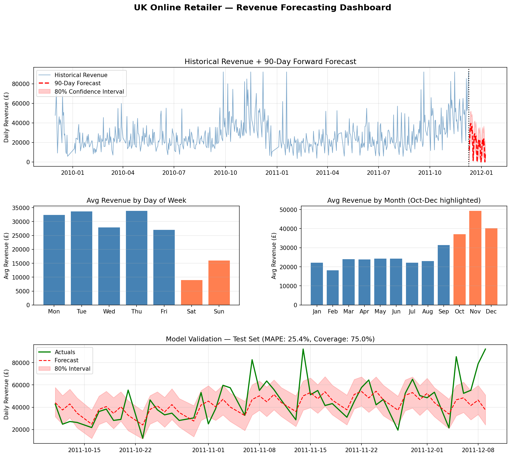

# UK Online Retailer — End-to-End Revenue Forecasting Pipeline



## Business Objective

A UK-based wholesale retailer needed a reliable way to anticipate daily revenue
fluctuations to support staffing, inventory, and capital allocation decisions.
This project delivers a full forecasting pipeline — from raw transaction data
to a 90-day forward revenue forecast with confidence intervals.

---

## Dataset

- **Source:** UCI Machine Learning Repository — Online Retail II Dataset
- **Scope:** UK transactions only (92% of original data)
- **Raw size:** 1,067,371 transactions across 2 years (2009–2011)
- **After cleaning:** 958,501 transactions → 604 daily revenue observations

---

## Data Quality Decisions

Real-world data is messy. Here is what we found and how we handled it:

| Issue | Scale | Decision | Reason |
|-------|-------|----------|--------|
| Cancelled orders (Invoice starts with 'C') | ~12,000 rows | Removed | These are reversals, not revenue |
| Negative quantities | ~500 rows | Removed | Returns already captured by cancellations |
| Zero/negative prices | ~1,600 rows | Removed | Internal transfers, not sales |
| Non-UK transactions | ~8% of data | Removed | Different demand patterns, cleaner model |
| Outlier days (>99th percentile) | 4 days | Capped at £84,974 | Wholesale one-off orders; deletion breaks time series |

> **Key insight:** Average order value of £438–£602 indicates a B2B wholesale
> customer base, not consumer retail. This explains the strong weekday pattern
> and muted weekend activity.

---

## Data Architecture (3-Layer Model)

Inspired by dbt's layered approach used at companies like Airbnb and GitLab:
```
raw_transactions        (473,378 rows) — source data, never modified
      ↓
stg_transactions        (473,378 rows) — cleaned, typed, renamed
      ↓
mart_daily_revenue      (307 rows)     — one row per trading day, business-ready
```

Each layer has a single responsibility. If business rules change, only the
staging layer needs updating — dashboards and models built on the mart layer
are unaffected.

---

## Exploratory Findings

Two clear patterns emerged before any modeling:

**Weekly pattern:** Saturday revenue averages £9,042 — 73% below Thursday's
£34,680. This confirms a B2B customer base; businesses don't place wholesale
orders on weekends.

**Yearly seasonality:** November is the peak month at £49,060 average daily
revenue — 2.6x February's £18,948. Critically, November outperforms December,
suggesting customers are wholesale buyers purchasing Christmas stock in November
to sell in December.

These patterns were confirmed quantitatively and later learned automatically
by the Prophet model.

---

## Modeling Approach

**Model:** Facebook Prophet with logistic growth, multiplicative seasonality,
and UK public holidays.

**Why multiplicative seasonality?** Q4 peaks scale proportionally with the
business's overall revenue level. As the business grows, the November surge
grows with it — this is multiplicative behavior, not additive.

**Why logistic growth?** To enforce a revenue floor of zero. Linear growth
models can predict negative revenue during post-holiday dips — logistic growth
with a floor constraint prevents this.

**Critical lesson learned:** An initial model trained on only 1 year of data
produced MAPE of 49.7% because Prophet cannot reliably learn yearly seasonality
from a single cycle. Adding a second year of data reduced MAPE to 25.4% — a
54% improvement. Two years is the minimum for seasonal forecasting.

---

## Model Evaluation

Evaluated on a held-out 52-day test set (temporal split — no data leakage):

| Metric | Value | Interpretation |
|--------|-------|----------------|
| MAE | £11,202 | Average daily forecast error |
| RMSE | £15,950 | Penalizes large errors more than MAE |
| MAPE | 25.4% | Within 20–35% industry benchmark for daily retail |
| Bias | -£3,416 | Slight under-forecast; model is conservative |
| Coverage | 73.1% | 73% of actuals fall within 80% prediction interval |

---

## Key Business Insights

1. **Staff and inventory planning should follow a 5-day week.** Saturday
   volume is so low it does not justify full operational staffing.

2. **Q4 planning should begin in September.** Revenue starts climbing in
   October and peaks in November — not December. Teams waiting until December
   to react are already behind.

3. **The 90-day forecast projects a post-holiday January dip.** This is
   consistent with both years of historical data and should be factored into
   January cash flow planning.

4. **Four outlier days (>£85K) were wholesale bulk orders.** These are not
   forecastable from time series alone and would benefit from a separate
   order pipeline tracking large accounts.

---

## Tools & Technologies

- **Python** — pandas, Prophet, scikit-learn, matplotlib
- **SQL** — SQLite (3-layer data model: raw, staging, mart)
- **Data:** UCI Online Retail II (real transaction data, not synthetic)

---

## How to Run
```bash
# Clone the repo
git clone https://github.com/YOUR_USERNAME/uk-retail-revenue-forecasting

# Open in Google Colab or Jupyter
# Run cells sequentially in forecasting_pipeline.ipynb
```

---

## Project Structure
```
.
├── forecasting_pipeline.ipynb   # Full pipeline: EDA → SQL → Prophet → Evaluation
├── forecasting_dashboard.png    # Summary dashboard (4-panel)
└── README.md
```

---

*Data source: UCI Machine Learning Repository — Online Retail II Dataset.
All analysis is for portfolio demonstration purposes.*
